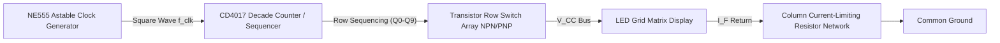

# LED Matrix Without Microcontroller

## Executive Overview
Modern displays and visual electronics rely almost entirely on embedded microcontrollers for display timing and multiplexing. This project takes a rigorous, back-to-basics approach by engineering an **LED Matrix Display** using strictly discrete digital logic and hardware components. Relying on an NE555 timer for astable clock generation and a CD4017 Decade Counter for sequential row sequencing, the circuit exploits human Persistence of Vision (POV) to render static images or patterns across an LED grid without writing a single line of firmware.

> [!WARNING]
> **Electrical Safety & LED Overcurrent Callout**
> Direct-driving matrix topologies places severe demands on the sourcing and sinking capabilities of standard digital ICs. Multiplexed LEDs are subjected to peak pulse currents far exceeding their continuous forward current ($I_F$) ratings. Care must be taken to appropriately calculate the column current-limiting resistors. Failure to account for the duty cycle ($D$), the transistor saturation voltage ($V_{CE,sat}$), and the reverse breakdown voltage ($V_R$) can lead to instantaneous junction failure of the LEDs or thermal destruction of the CD4017 outputs.

## System Highlights
- **Zero Firmware Dependency**: 100% hardware-executed finite state logic, entirely eliminating microcontroller overhead, software compilation, and boot times.
- **Astable Clock Generation**: Precise tuning of RC networks to drive an NE555 timer at a calculated high-frequency rate.
- **Sequential Row-Column Multiplexing**: Utilizes a CD4017 Johnson counter to sweep through the matrix rows sequentially.
- **Persistence of Vision (POV) Exploitation**: Operates the multiplexing refresh rate well above the human flicker-fusion threshold ($\ge 50\text{Hz}$), creating the optical illusion of a fully active, static multi-row display.

## System Architecture Diagram

## Theoretical & Mathematical Models

### 1. NE555 Astable Clock Frequency & Duty Cycle

The clock frequency ($f_{\text{clk}}$) driving the sequence is governed by the timing resistors ($R_1, R_2$) and the timing capacitor ($C$):

$$
f_{\text{clk}} = \frac{1.44}{(R_1 + 2R_2)C}
$$

The pulse widths and Duty Cycle ($D$) evaluate to:

$$
T_{\text{high}} = 0.693(R_1 + R_2)C, \quad T_{\text{low}} = 0.693 R_2 C, \quad D = \frac{R_1 + R_2}{R_1 + 2R_2}
$$

### 2. Matrix Multiplexing & Persistence of Vision (POV)

To eliminate perceived flicker to the human eye, the entire matrix frame must be refreshed at least 50 times per second ($f_{\text{frame}} \ge 50\text{ Hz}$). For an $N$-row matrix:

$$
f_{\text{clk}} \ge N \times f_{\text{frame}}
$$

*(Example: For an 8-row matrix, the NE555 clock must be tuned to at least $400\text{ Hz}$).*

### 3. Current-Limiting Resistor & Peak Dynamic Current

Because each row is only illuminated for a fraction of the time ($1 / N$), the instantaneous peak current ($I_{\text{peak}}$) sent through the LEDs can be higher than the continuous rating, but the protective resistor must be sized based on the voltage drops:

$$
R_{\text{limit}} = \frac{V_{CC} - V_F - V_{CE,\text{sat}}}{I_F}
$$

Where $V_F$ is the LED forward voltage, and $V_{CE,\text{sat}}$ is the voltage drop across the row-switching transistor.

## Hardware Bill of Materials (BOM)
| Component Type | Function |
| :--- | :--- |
| **NE555 Timer** | Astable square-wave clock generation |
| **CD4017 Decade Counter** | Johnson counter for sequential row activation |
| **NPN Switching Transistors** | (e.g., 2N2222 or BC547) Row high-current sourcing |
| **Discrete LEDs** | The visual matrix array elements |
| **Carbon Film Resistors** | Timing networks ($R_1, R_2$) and column limiters ($R_{limit}$) |
| **Timing Capacitors** | Electrolytic and ceramic caps determining $f_{clk}$ |

## Multiplexing & Timing Calibration Guide
1. **Clock Calibration**: Probe pin 3 of the NE555 with an oscilloscope. Adjust the $R_1/R_2$trimmer potentiometers until the measured frequency exceeds$N \times 50\text{Hz}$.
2. **Sequencing Verification**: Probe the Q0 through QN output pins on the CD4017. Ensure consecutive, non-overlapping active-high pulses.
3. **Matrix Hardwiring**: The desired visual pattern or "image" is fundamentally hard-coded by physically mapping the cathode connections of specific LEDs to the ground return columns.

## Authentic Media Catalog
- **Engineering Report**: [`docs/Discrete_LED_Matrix_Engineering_Report.pdf`](docs/)
- **Original Schematics & Physical Hardware**: Located in [`media/photos/`](media/photos/) as **[ORIGINAL HARDWARE & SCHEMATIC ARTIFACTS]**.
- **Demonstration Video**: Available in [`media/videos/`](media/videos/) as **[ORIGINAL PROTOTYPE TEST VIDEO]**.

## Engineering Audit & Tradeoffs
- **Hardwired Logic vs. Microcontroller Flexibility**: While this discrete architecture eliminates firmware development, the displayed pattern is physically immutable. Changing the displayed icon or text requires physically rewiring the LED cathodes or modifying a diode ROM matrix, making it inflexible compared to an MCU-driven design utilizing shift registers (like the 74HC595 or MAX7219).
- **Component Count & Power Inefficiency**: The parts count scales horribly with complexity. Without integrated driver ICs, a dense matrix requires massive arrays of discrete switching transistors and current-limiting resistors, significantly increasing PCB footprint and assembly time.

---

**Hassan Moqbel Morshed Ghaleb**
Mechatronics Engineer | Mechanical Design & CAD (SolidWorks & AutoCAD) | Preventive Maintenance & Electromechanical Systems | Industrial Automation, Control Systems, Robotics & Intelligent Machines | CAD/FEA, Embedded Systems, Python & C++
[GitHub](https://github.com/Hassan-Moqbel) · [Facebook](https://www.facebook.com/share/1BqxAgVjHi/) · [LinkedIn](https://www.linkedin.com/in/hassan-moqbel)

## License
This project is licensed under the [MIT License](LICENSE).
